# 🛒 ShopKart

A full featured shopping cart app built with React, TypeScript, Tailwind CSS v4, and shadcn/ui.

---

## 📖 Description

ShopKart pulls live product data from [fakestoreapi.com](https://fakestoreapi.com) and lets users browse, filter, sort, and manage a shopping cart.
The goal of this project is to practice:
- Reducer + Context pattern for global state management
- Custom hooks as the interface between context and components
- React features — `use()` hook, new Context syntax, `use(Promise)` + Suspense
- TypeScript strict typing — no `any` allowed anywhere
- Mobile-first UI with Tailwind CSS v4 and shadcn/ui components
- Progressive Web App setup with a service worker
- Lighthouse practices accessibility, performance, SEO, and PWA

---

## 🖥 Tech Stack

- React
- TypeScript 
- Vite
- Tailwind CSS
- shadcn/ui
- fakestoreapi.com (product data)

---

## 📂 Project Structure

```
shopping-cart/
│
├── public/
│   ├── manifest.json
│   └── sw.js
│
├── src/
│   ├── components/
│   │   ├── Navbar.tsx
│   │   ├── ProductGrid.tsx
│   │   ├── ProductCard.tsx
│   │   └── CartDrawer.tsx
│   │
│   ├── context/
│   │   ├── CartContext.tsx
│   │   ├── cartReducer.ts
│   │   └── CurrencyContext.tsx
│   │
│   ├── hooks/
│   │   └── useCart.ts
│   │
│   ├── types/
│   │   └── index.ts
│   │
│   ├── utils/
│   │   └── currency.ts
│   │
│   ├── lib/
│   │   └── utils.ts
│   │
│   ├── App.tsx
│   ├── main.tsx
│   └── styles.css
│
├── index.html
├── vite.config.ts
├── tailwind.config.ts
├── components.json
├── package.json
└── README.md
```

### Folder Responsibilities

- **components/** → UI building blocks — each component reads from context via hooks, zero cart props passed in
- **context/** → All global state — the reducer, the CartProvider, and the CurrencyProvider
- **hooks/** → `useCart`, `useCartDispatch`, `useCartItem` 
- **types/** → Every TypeScript interface and type in one file 
- **utils/** → Pure helper functions — `formatPrice` and currency rates
- **lib/** → shadcn's `cn()` utility — this was auto-generated during `npx shadcn@latest init` using tailwind to help with reducing the number of css lines thought components eg,. ProductCard, CartDrawer, ProductGrid. For instance the function skeleton loader that help mimin the shape of the content for the loading instead of a spinner.

---
## 📸 Screenshots

### 📱 Mobile View — Product List
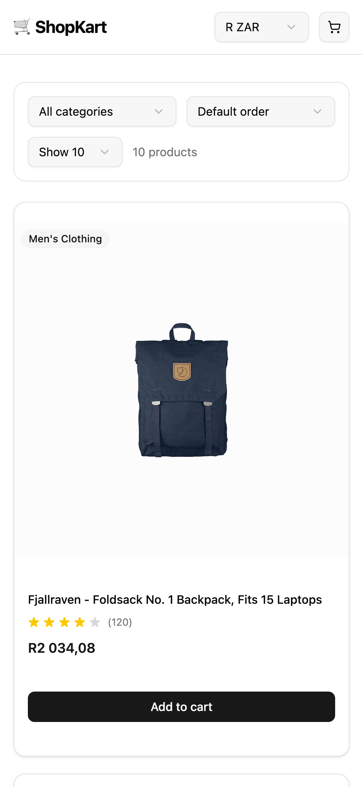

### 📱 Mobile View — Adding Items to Cart
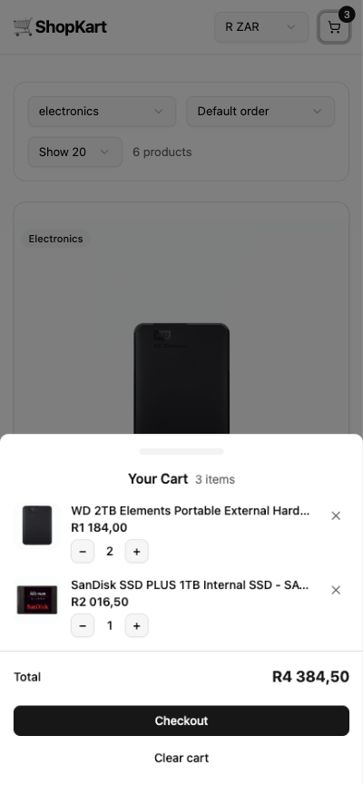

### 📱 Mobile View — Cart Item Quantity Change
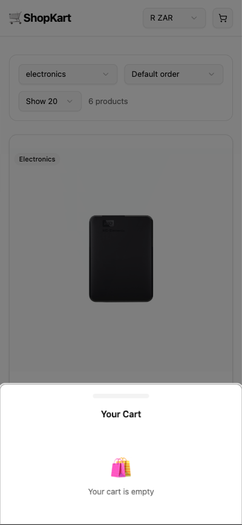

### 📱 Mobile View — Remove Item from Cart
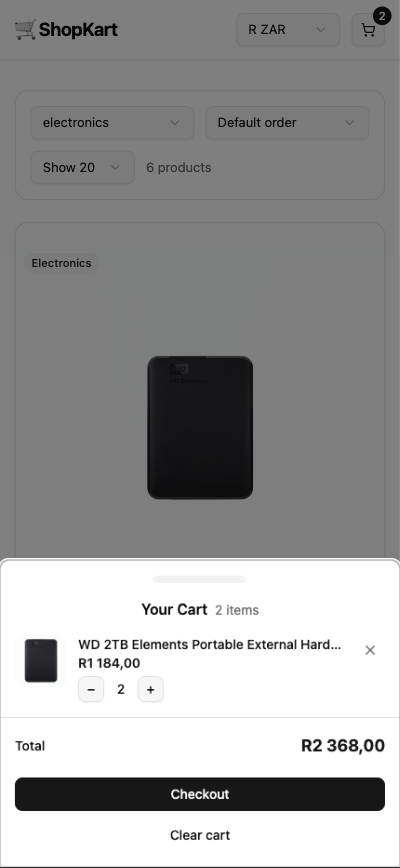

### 📱 Mobile View — Category Filter Dropdown
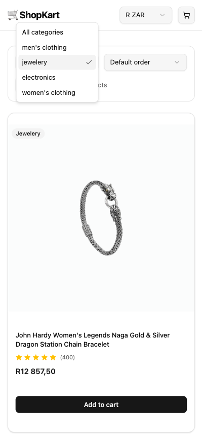

### 📱 Mobile View — Currency Selector
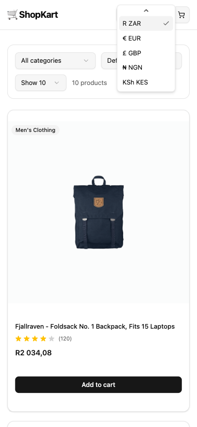

### 📱 Mobile View — Items Per Page Selector
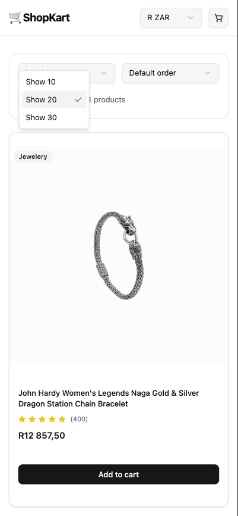

### 📱 Mobile View — Sort by Price / Name
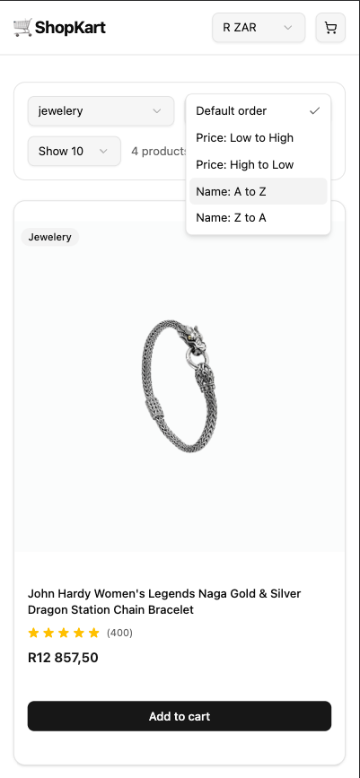

---

### 💻 Desktop View — Product List
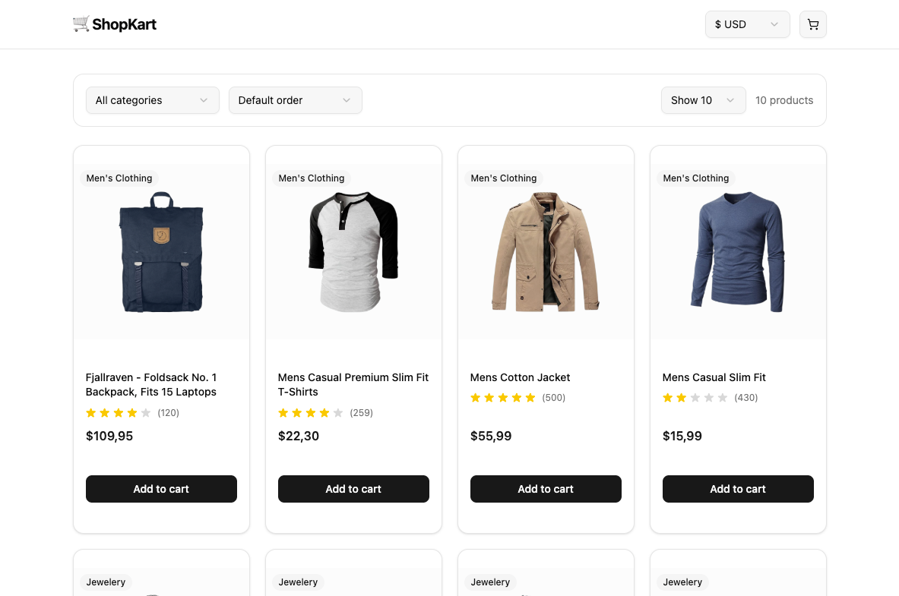

### 💻 Desktop View — Cart Open
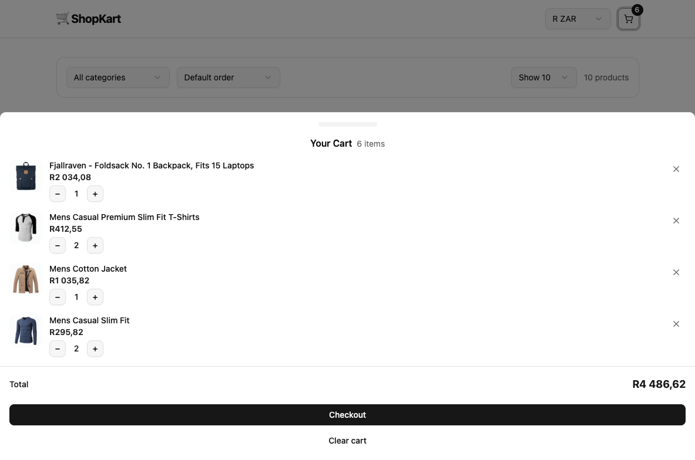

### 💻 Desktop View — Cart Item Quantity Change
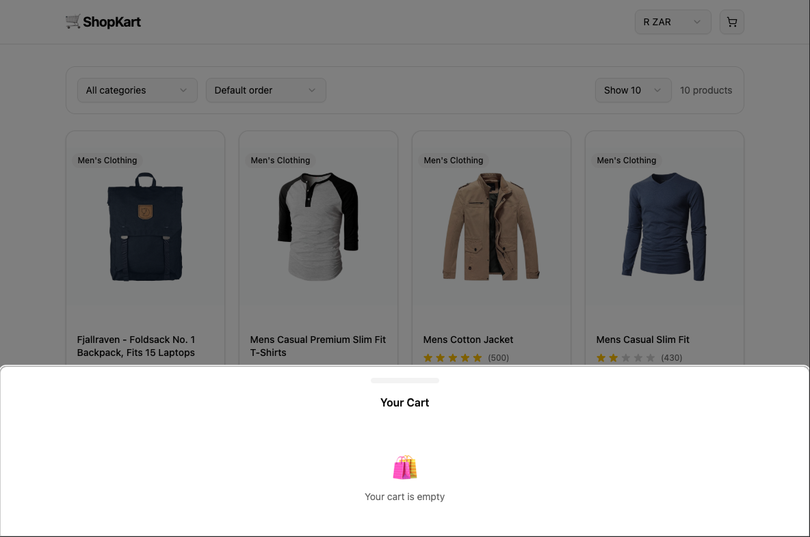

### 💻 Desktop View — Remove Item from Cart
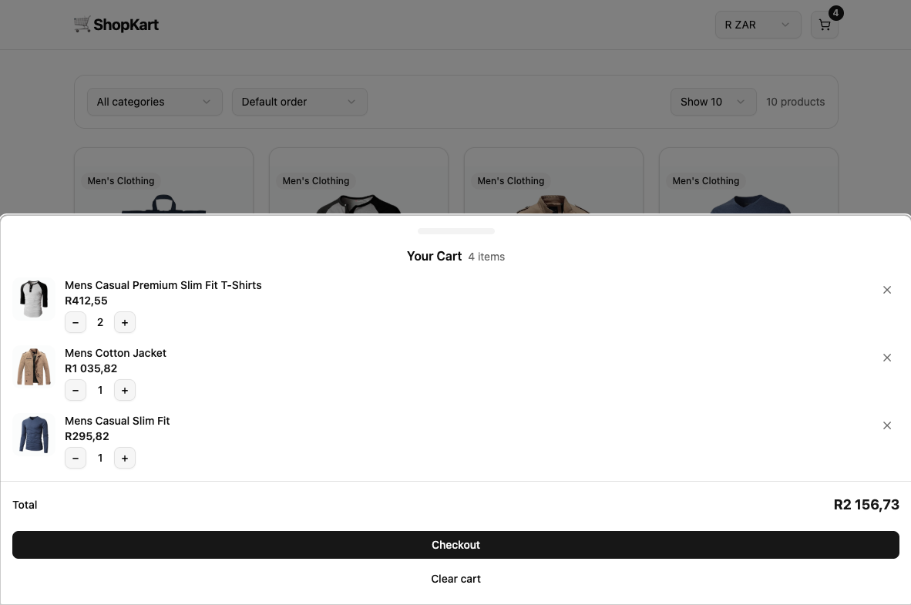

### 💻 Desktop View — Category Filter Dropdown
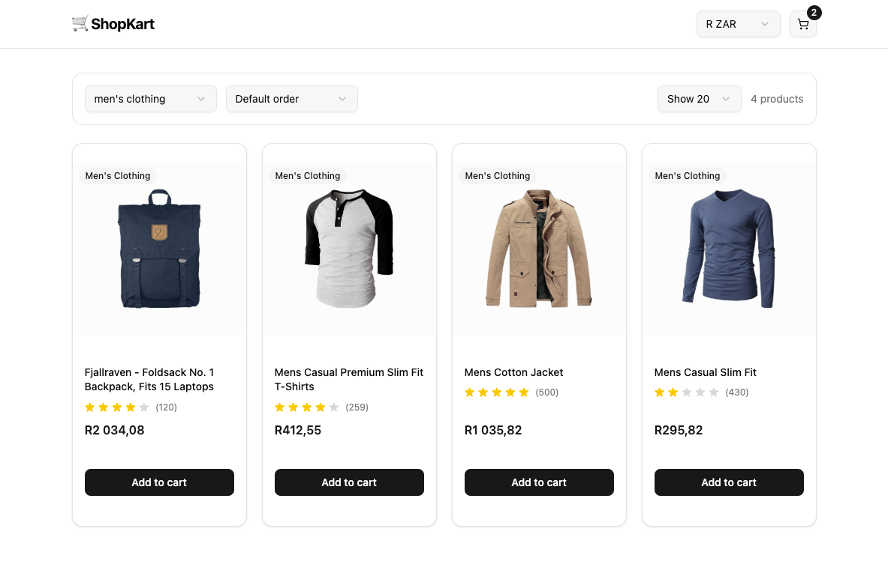

### 💻 Desktop View — Currency Selector
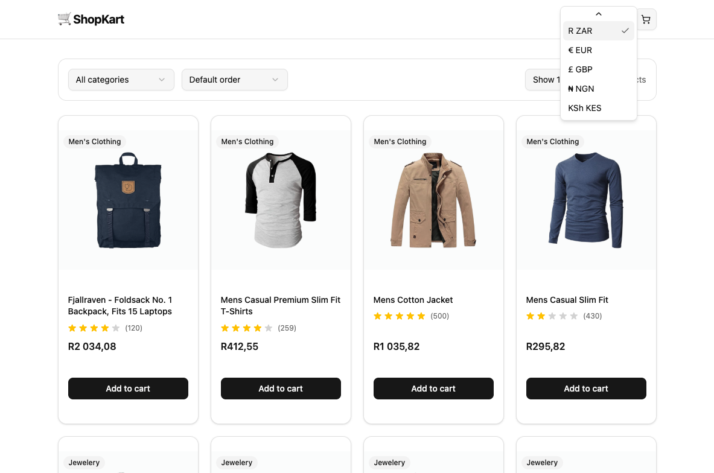

### 💻 Desktop View — Items Per Page Selector
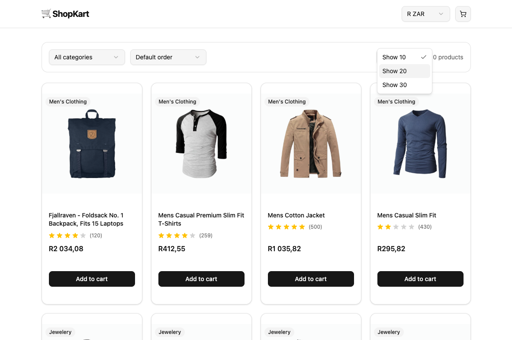

### 💻 Desktop View — Sort by Price / Name
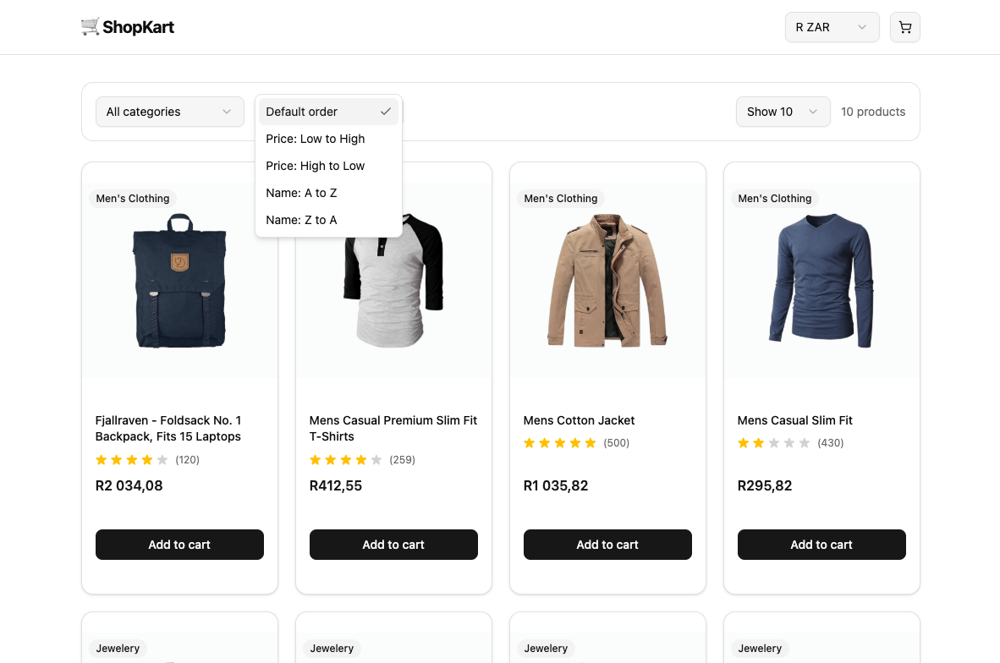

### 🔦 Light House Analysis View — This can improve quite a bit 🙂


> Store screenshots in:
> `src/assets/screenshots/`

---

## ⚙️ Installation & Setup

1. Clone the repository:
   ```bash
   git clone https://github.com/your-username/shopping-cart.git
   ```

2. Navigate into the project:
   ```bash
   cd shopping-cart
   ```

3. Install dependencies:
   ```bash
   npm install
   ```

4. Start the development server:
   ```bash
   npm run dev
   ```

5. Open in your browser:
   ```
   http://localhost:5173
   ```

### Build for production

```bash
npm run build
npm run preview
```

---

## 🎯 What I Learned

- How the Reducer + Context pattern solves prop drilling completely
- The difference between state (lives in the reducer) and derived values (in hooks)
- Why splitting CartStateContext and CartDispatchContext prevents unnecessary re-renders
- Tailwind CSS v4 with the Vite plugin 
- How shadcn CSS variables power the entire colour system from one file
- Lighthouse requirements

---

## 🚀 Future Improvements

- Add a wishlist feature using the same Reducer + Context pattern
- Replace static exchange rates with live data from a currency API
- Add a product detail page
- Connect a real checkout flow with a type of payement method like Stripe, PayPal etc.